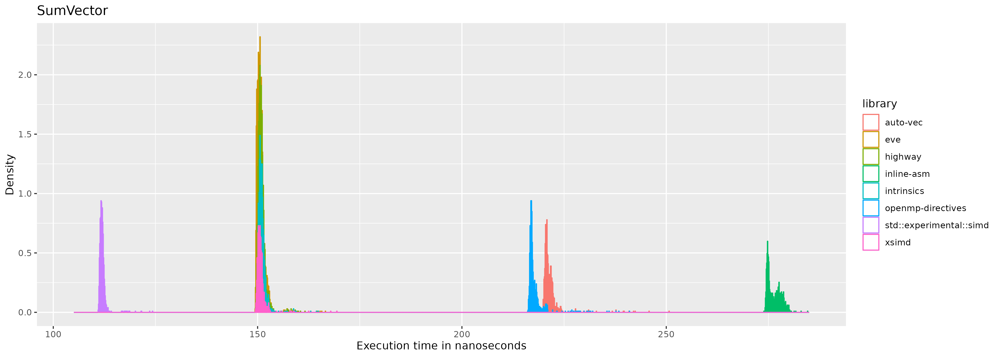

\vfill
Liverpool Hope University   
School of Mathematics, Computer Science & Engineering   
04/24/2024   
\newpage

## Abstract

## Introduction

Vectorization is an old buzzword that has recently gotten a lot of attention in the worlds of graphics, AI, and big data. In part, the term ‘vectorization’ refers to the execution of a single instruction on multiple pieces of data at the same time. SIMD (‘Single instruction multiple data’) registers in the CPU are responsible for this. In contrast, the modern norm: the MIMD (‘Multiple instruction multiple data’) registers, utilizes multiple cores to achieve high degrees of parallelism and runs multiple instructions concurrently on multiple pieces of data. MIMD has proven extremely effective for increasing performance in general-purpose processing, particularly running lots of processes concurrently (Flynn, 1972). SIMD registers have a more specialized use case which can optimize a single process if used credibly. The terms SIMD, and MIMD are classifications for computer architectures (Flynn’s taxonomy) proposed by Michael J. Flynn in 1966. 

Consequently, modern x86 CPUs generally have many more MIMD registers than SIMD registers (Intel, 2023). The SIMD registers can utilized with a specific intruction set. The two widely adopted standard instruction sets are the SSE instruction set and the Advanced Vector Extensions instruction set. These standards have various versions such as AVX128, AVX2, AVX512 which introduce new and improved instructions with every itertion. Programs written in any modern programming language process statements, and hence the data being processed, in a scalar form by executing each statement according to a control flow. This is necessary because each statement processes data that has a dependency to this control flow. 

Therefore, to simplify for the purpose of this paper, vectorization is enabling a part of a program to process a single instruction N times simultaneously (vectorized) as opposed to processing that instruction N times consecutively (scalar).

The recent realization that Moore’s law no longer holds due to extreme heat build-up at higher CPU clock speeds has driven the shift toward multicore architectures (Etiemble, 2018). Furthermore, “the DRAM structures and interfaces have evolved to avoid a ‘memory wall’. However, even with a reduced memory CPI component, pipeline stalls due to memory waits still exist when executing a single program” (Etiemble, 2018). Indicating that even with the SIMD register’s ability to effectively process N statements simultaneously, N values still need to be loaded into the SIMD register. Thus the ‘memory wall’ as described by Etiemble et al. quickly becomes the new bottleneck instead of the clock speed. Regardless, SIMD technology can still increase our programs' performance although the expected N times increase is usually not visible due to the abovementioned limitations.

The present study will compare and contrast the execution time of different SIMD programming paradigms that C++ developers have available to them when manipulating vectors. Furthermore, this paper will explore the impact each paradigm has on portability, maintainability, and the development process whilst also discussing ongoing advancements in each. This topic is relevant since a notable amount of research and development has gone into SIMD registers and CPUs in recent years. However, the research addressing the application of these recent CPU developments is lacking. Whilst the former is important, the latter also needs widespread adoption to increase the general performance of programs as a whole.

## Literature Review

This literature review aims to explore all SIMD programming paradigms available in C++ as well as evaluate the current developments for each. Preliminary research suggests that the methods for writing vectorized code (programming paradigms) can be categorically divided into four distinct sections, namely: auto-vectorization, OpenMP directives, intrinsics, and high-level libraries. 

Through my exhaustive search on article databases such as Google Scholar and Jstor, a thorough examination of the existing literature was conducted. Despite SIMD being a well-researched area, it was observed that the literature regarding how to implement SIMD as a developer effectively was sparse. The paper “An Evaluation of Current SIMD Programming Models for C++” from the Technical University of Berlin (Pohl et al., 2016) stands out since it was the only paper found in this search that bears a resemblance to the aim and scope of this study. 

Pohl et al. (2016), similarly to this study, evaluates current SIMD programming paradigms, benchmarking each paradigm and weighing the benefits and disbenefits of each. While this paper provides foundational knowledge into the different SIMD programming paradigms available to C++ developers, there are distinct differences to the aim of this study. First and foremost, “An Evaluation of Current SIMD Programming Models for C++” primarily compares and contrasts well-established high-level libraries that facilitate SIMD programming by measuring execution time on various benchmarks. Contrarily, the present paper aims to evaluate high-level libraries as a whole, as a SIMD programming paradigm, and compare and contrast this paradigm against others (OpenMP Pragma directives, Auto-vectorization, and SIMD intrinsics). Furthermore, Pohl et al. (2016) evaluates each programming paradigm using graphics based benchmarks such as HEVC decoding. This process relies heavily on matrix multiplication. Conversely, the present paper aims to use simple vector based benchmarks to evaluate the performance in hopes of finding a more generalizable result.

### Auto-vectorization

Auto-vectorization is when the compiler generates assembly that makes use of the SIMD registers. This SIMD programming paradigm is practically equivalent to programming without the knowledge of the SIMD register’s existence. Thus making auto-vectorization the most maintainable and most portable SIMD programming paradigm because the written code does not change. Unfortunately, reviewing the implementation of popular static single-assignment (SSA) based compilers highlights that given the information a compiler has at compile time, it is impossible to perfectly auto-vectorize. James Rainders, a former developer of Intel’s C/C++ compiler (ICC) auto-vectorization feature mentioned in a C++ conference in 2016 that there is “No magic compiler coming soon”.

To answer the question of whether we can trust a compiler to vectorize our code, a basic understanding of how a compiler sees our code is required. The present study is based on the models presented in Rastello et al. (2022) “SSA-based compiler design”. Given this understanding, a discussion of the vectorization methods used by popular compilers such as LLVM and GCC is discussed thoroughly in Wei et al. (2015). Wei et al. (2015) provides details about loop-level, function-level, and block-level optimization techniques used in compiler design to auto-vectorize our C++ code. Tayeb et al. (2023) discusses methods to improve auto-vectorization given irregular data access patterns. The IBM research report by Nuzman et al. (2005) discusses the challenges faced by auto-vectorizing compilers due to non-uniformity, limited data types, and memory access restrictions and provides an efficient method to handle non-contiguous data with power-of-2 strides while exploiting data reuse.

From reviewing the aforementioned sources, it is clear that automatic vectorization is a highly complex topic and has its limitations, and generally does not provide the performance increase that one would expect. To summarize, the primary reasons for this are:  
1. Taking Intel's SIMD extended instructions as an example, the execution time required to implement vectorization of one 16-bit operation is 1/2 of the time of eight 16-bit operations, not 1/8 as would be expected.   
2. The program itself calculates the constraints of the memory access ratio, and secondly, the program is divided into vectorizable parts and non-vectorizable parts. Constrained by Amdahl's law, The acceleration ratio is also limited by the proportion of vectorizable code in the application. When there are too many non-vectorizable parts of the program, the acceleration effect is still poor.   
3. Due to the limitations of program analysis and optimization technical capabilities, it is not all vectorizable parts of the program are discovered.  

By analyzing the implementation of auto-vectorization in GCC and LLVM, it is obvious that the SIMD compilation process is roughly divided into three parts. Namely, building the dependency graph, reasoning what optimizations can be made, and code generation. Building the dependency graph contains processes such as: converting code to compilers intermediate representation (SSA), In-lining, and clustering. Following this, the compiler can reason with the information gathered from the previous steps and perform loop-level optimization, block-level optimization, and function-level optimization. Due to the complexity of this topic, the given explanation presents a deliberate simplification to build a foundational model of auto-vectorization and its core principles. A more detailed overview will be presented in the discussion.

### OpenMP pragma flags

OpenMP (2012) defines their programming paradigm as: “The OpenMP API supports multi-platform shared-memory parallel programming in C/C++ and Fortran.”. OpenMP provides a standardized set of Pragma directives which can provide the compiler with more context to aid in the automatic optimizations performed by the compiler. We can utilize OpenMP pragma flags to leave a hint for the compiler to vectorize a certain section of the code using the flag #pragma omp simd. It is up to the compiler’s implementation to decide what to do with this hint.

From reviewing ICC’s documentation (Intel, 2023:678563), the market-leading and proprietary compiler from Intel, it is clear that the use of OpenMP Single Instruction Multiple Data (SIMD) directives to tell the compiler what code to vectorize has a strong effect (Breshears, 2020). In essence, the OpenMP SIMD directive will only have an effect when the ICC compiler observes an opportunity where a loop can be vectorized, but cannot be certain at compile time that vectorizing this loop would not change the order of execution. Other sources primarily praise OpenMP directives due to their ease of use and low impact on portability. "Compared to manually parallelizing the relevant code (e.g., using the pthreads library) or manually vectorizing the relevant code (e.g., using SIMD-intrinsics or assembly), annotating a loop with OpenMP pragmas yields much higher programmer productivity." (Kruse and Finkel, 2022)

### Intrinsics

Krukunas (2015:12.5.3) defines compiler intrinsics as “built-in functions provided by the compiler that share a one-to-one, or many-to-one, relationship with specific (assembly) instructions”. Intrinsics actual implementation is directly handled by the compiler. hence the burden of optimization is taken from the compiler to the developer. Unfortunately, due to the unstandardized nature of CPU’s SIMD instruction sets (Altivec, SSE, NEON etc.) writing a program with intrinsics is extremely dependent on its architecture. 

Intrinsics provides a middle ground between high-level C++ and low-level assembly, allowing programmers to write user-friendly and easy-to-understand code. While still allowing developers to interact directly with machine instructions. This transparent use of SIMD instructions, without the use of assembly language, gives the programmer more control over the hardware, often resulting in significant performance improvements in specialized applications. 

Intrinsics can offer the best performance compared to other SIMD programming paradigms if used correctly but sacrifices portability, maintainability, and stability in turn due to its dependency on specific architectures and compilers. Intrinsics should not be used outside of high-performance computing applications. Apart from compromising maintainability and portability, their long names and complicated documentation increase the risk of bugs due to the potential for incorrect assumptions. This is the consensus observed from an analysis of various sources. Namely, the publication High Performance Programming by Jeffers et al. (2016) in the chapters: exploration of Quantum Chromodynamids, and Vectorization with AVX-512 intrinsics, recognizes the trade-off between performance and portability due to the architectural dependency. Similarly, Martin et al. (2023) in The Designer's Guide to the Cortex-M Processor Family states "The Cortex-M CPU supports saturated maths instructions which stick at their maximum and minimum values... If you want to use the saturated maths instructions, you have to access them by using compiler intrinsics or by using the CMSIS-Core functions...". Most notably, Krukunas (2015) in Power and Performance bluntly states that "Unfortunately, compiling intrinsics with GCC can be somewhat annoying.” and continues with a explanation detailing intrinsics lack of portability: “This stems from the fact that certain instruction sets can only be generated by the compiler when they are explicitly enabled in the CFLAGS. However, when the instruction sets are enabled in the CFLAGS, they are enabled to be generated everywhere, that is, there is no guarantee that all of the instructions will be protected by a CPUID check. For example, attempting to compile Intel AVX2 compiler intrinsics without the -mavx2 compiler flag will result in compilation failure."

Reinders et al. in High Performance Parallelism Pearls (2016) commends the active developments of ‘portable intrinsics’ alternatively referred to as high-level libraries. “Portable intrinsics can also provide a fast and effective way to develop and experiment with new or proposed hardware architectures. Instead of waiting for hardware availability and fully matured auto-vectorizers for an architecture, developers can use portable intrinsics to generate efficient vector code and take advantage of hardware emulators.” (Reinders et al., 2016).

### High-level libraries

The most popular approach to SIMD programming is to leverage already existing high-level C++ libraries. This method abstracts away intrinsics from the developer by detecting at compile time what architecture the program is being run on and consequently running the appropriate intrinsics given the architecture. This approach enables the use of intrinsics whilst supporting portability and maintainability. 

Many of these libraries take a specialized approach to applying SIMD by providing a tool that applies SIMD intrinsics to increase the performance of its processes. Interesting examples of such libraries:  
‘simdjson’ which is capable of “parsing gigabytes of JSON per second” (simdjson, 2024).  
‘sneller’ which is “World's fastest log analysis: Lamda + SQL + JSON + S3” (sneller, 2024).  
‘computeLibrary’ which is “a set of computer vision and machine learning functions optimised for both Arm CPUs and GPUs using SIMD technologies.” (computeLibrary, 2024).

The limitations of using high-level libraries are readily apparent. Due to the nature of how these libraries are created, the resulting size of an executable binary will be inflated with ‘dead’ code. Furthermore, due to the support for portability, and the unstandardized nature of SIMD registers, a lowest common denominator has to be established. As a result, high-level libraries may inadvertently constrain the full usage of more advanced and efficient features in newer architectures.

The consensus regarding performance when it comes to high-level libraries is established to be significantly lower than the same implementations using intrinsics but significantly faster than auto-vectorized code. 

As announced by the C++ International Organization for Standardization (ISO) in their technical specification: ISO/IEC 19570, a high-level SIMD library is coming to the standard C++ library as std::simd in C++ 26. It is worth noting that the latest stable release of C++ is version 20 and the experimental release of C++ is 23. This addition to the C++ standard library is highly welcomed by the community and has gathered much traction even though the planned release is still far in the future. Intel has published an official response to the technical specification published by the C++ ISO where much feedback was shared and discussed. Intel being responsible for the market-leading C/C++ compiler (ICC), makes their feedback particularly valuable for the C++ ISO. The current implementation of the proposed high-level SIMD library to be added to the standard library can be found on Github.

### Measuring performance

To be able to measure the performance of a program you first have to define a metric. Carrington et al. (2005) concludes that using a simple and single metric to represent a high performance compute (HPC) workload is 'inadequate', and that the use of an aggregation of various simple metrics will also peform poorly. Nonetheless, the 'simple' metric floating point operations per seconds (flops) is often used. Numrich et al. (2004) proposes a new metric which is based on 'computational action'. "We examine work as it evolves in time and compute computational action as the integral of the work function over time. We compare the action generated at less than full power with the action that could have been generated at full power. We claim that the goal of performance optimization is to minimize lost, or wasted, action". Drawing inspiration from Pohl et al. (2016), the present paper aims to evaluate the different SIMD programming paradigms using execution time, not taking into consideration the efficiency of the program, effectively circumnavigating the unstandardized nature of 'perfomance'.

Sources of error  
- Random vs systemic error  
- Random error is unavoidable so we need to use statistics!!  
- Why is it unavoidable?  
  - Hardware jitter:  
    - Intstruction pipelines: The pipeline fill level has an effect on the execution time for one instruction. Difference in CPU/memory bus clock cycles: The CPU clock cycle is different from the memory bus clock speed. Your CPU sometimes has to wait for the synchronization of memory accessess. CPU frequecy scaling and power management: These features cause heterogeneities in processing power. Shared hardware caches: Caches shared between multiple cores/ threads are subject to variance due to concurrent use. Larger memory segments may have variance in access times due to physical distance from CPU.  
  - Additionally, OS activities can cause non-determinism. Some hardware interrupts require OS handling immediately after delivery. Migration of non-pinned processes can affect the performance of CPU hueristics.  
SOURCE: https://www.chronox.de/jent/CPU-Jitter-NPTRNG.pdf (Müller, 2022)   
OBSERVER EFFECT ALERT!! any time we observe something we are also changing the result... Because we are adding stuff to measure which adds overhead... This is not a problem though for us as we are keeping the instrumentation the same across all tests and we aren't worried about actual execution_time. just how they relate to each other. What libs are there?
Hot vs cold performance, caching, branch preditiction. too many things can happen...
Find more sources for all these

## Methods

To evaluate which SIMD programming paradigm is the 'fastest', eight implementations of these paradigms were selected. The GNU Compiler Collection (GCC) was selected as the compiler for all benchmarks due to its popularity. Consequently, the implementation details of auto-vectorization and OpenMP directives are also handled by GCC. The specific libraries chosen to represent the 'high-level libraries' paradigm are: XSimd, EVE, Highway, and std::experimental::simd. 

XSimd is being used by major open-source projects, such as Mozilla Firefox, Apache Arrow, Pythran, and Krita. XSimd is actively being developed and has 68 core contributors at the time of writing.

EVE is a re-implementation of the old SIMD library by Falcou et al. (2019) named Boost.SIMD. Boost.SIMD before being made propietary in 2019 due to disagreements in the community, was a very popular high-level SIMD library. Many of the core contributors that worked on Boost.SIMD have switched over to EVE. Unlike XSimd, EVE has a tight group of 16 contributors.

Highway is an open source SIMD library actively being developed by Google. It has 3 to 4 commits per day and an impressive test suite, works on the widest range of targets out of all libraries mentioned.

std::experimental::simd is an early beta version of the SIMD library mentioned in the literature review coming to the standard libary (SIMDISO/IEC 19570) planned for C++ 26. This early beta was released for testing in 2018 and is actively being revised by the open source community.

Lastly, each benchmark will also be run using scalar/ un-vectorized code compiled using GCC as a baseline.

### Measurements

Google's benchmark library is used to measure and create each benchmark. This library abstracts complex low-level benchmark design to give a more userfriendly benchmarking experience. Google benchmark returns the execution time of a specified benchmark in nano seconds with 4 decimal places. Thus the uncertainty of our measurements are +- 0.5 femtoseconds or +- 0.00005 nanoseconds. Google benchmark's parameter `->MinTime(0.5)` is used to ensure that the execution time recorded is the execution time of the function running 'hot'. After the function being measured has ran continously for atleast 0.5 seconds, and the variance of the execution time between the last 10 executions is lower than a specified threshold, Google benchmark will return the last execution time. It is important to note that it does not return an aggregate of the execution time. Given this, the measurement process is repeated 1000 times using the argument `->Repetitions(1000)` for each benchmark.

Using the evirontment variables of the host system, we can control the output medium and format of google benchmark. Before any benchmarks, these environment variables were defined to set the output format to `json` using: `export BENCHMARK_OUT_FORMAT=json`. The output medium (file or commandline) can be specified by setting the `BENCHMARK_OUT` environment variable to the file name.

The structure of the `json` output data can be seen in the example below:
```
{
  "context": {
    "date": "2024-05-02T09:30:37+01:00",
    "host_name": "Liam-W-MacBookAir",
    "executable": "./auto-vec",
    "num_cpus": 4,
    "mhz_per_cpu": 1800,
    "cpu_scaling_enabled": false,
    "caches": [
      {
        "type": "Data",
        "level": 1,
        "size": 32768,
        "num_sharing": 2
      },
      {
        "type": "Instruction",
        "level": 1,
        "size": 32768,
        "num_sharing": 2
      },
      {
        "type": "Unified",
        "level": 2,
        "size": 262144,
        "num_sharing": 2
      },
      {
        "type": "Unified",
        "level": 3,
        "size": 3145728,
        "num_sharing": 4
      }
    ],
    "load_avg": [1.05273,1.02295,1.00195],
    "library_version": "v1.8.3-73-gbc946b91",
    "library_build_type": "release",
    "json_schema_version": 1
  },
  "benchmarks": [
    {
      "name": "BM_AddVectors/1/2/3/4/min_time:0.500/repeats:1",
      "family_index": 0,
      "per_family_instance_index": 0,
      "run_name": "BM_AddVectors/1/2/3/4/min_time:0.500/repeats:1",
      "run_type": "iteration",
      "repetitions": 1,
      "repetition_index": 0,
      "threads": 1,
      "iterations": 1986354156,
      "real_time": 3.5172534056940363e-01,
      "cpu_time": 3.5169191047318954e-01,
      "time_unit": "ns"
    }
  ]
}
```

In the example above, a total of `1986354156` executions were run in `0.5` seconds to ensure that the final measured execution time was measured 'hot'.

### Setup
What did I do to set it all up?

### Creating the benchmarks
Algo's picked & why (brief)
Writing the benchmarks, maybe just go over the logic of how each algo is implemented
Compiling them, how each statement differs and why

### Running the benchmarks
Hardware used
Swappiness && CPUPower
Bash script

## Results
  - the assumption of normality is violated
  - assumption of homogenious variance is also violated
  - Therefore, kruskal.test 

  
  
  
  
  
  
  
  
  
  

Kruskal-Wallis rank sum test  
data:  execution_time by library : BMAddVectors  
Kruskal-Wallis chi-squared = 7585.3, df = 7, p-value < 2.2e-16

Kruskal-Wallis rank sum test  
data:  execution_time by library : BMFindInVector  
Kruskal-Wallis chi-squared = 7479.6, df = 7, p-value < 2.2e-16

Kruskal-Wallis rank sum test  
data:  execution_time by library : BMFindInVectorFaster  
Kruskal-Wallis chi-squared = 7747.4, df = 7, p-value < 2.2e-16

Kruskal-Wallis rank sum test  
data:  execution_time by library : BMReverseVector  
Kruskal-Wallis chi-squared = 7682.1, df = 7, p-value < 2.2e-16

Kruskal-Wallis rank sum test  
data:  execution_time by library : BMSumVector  
Kruskal-Wallis chi-squared = 7217.6, df = 7, p-value < 2.2e-16

## Discussion

This is where we analyze the assembly generated by each benchmark and try to understand why they performed the way they did? JUST THE HOT LOOP!! NO ONE CARES ABOUT THE FULL FUNCTION

## Conclusion

## Bibliography

Breshears, C. (2020). How to Use the OpenMP Single Instruction Multiple Data (SIMD) Directive to Tell the Compiler What Code to Vectorize. [Online]. Intel.com. Available at: https://www.intel.com/content/www/us/en/developer/articles/technical/delve-into-mysteries-openmp-vec [Accessed 2 February 2024].

Cppreference. (2018). SIMD library. [Online]. cppreference. Available at: https://en.cppreference.com/w/cpp/experimental/simd [Accessed 2 February 2024].

Etiemble, D., 2018. 45-year CPU evolution: one law and two equations. arXiv preprint arXiv:1803.00254.

GNU foundation. (n/a). 6.54 Using Vector Instructions through Built-in Functions. [Online]. gcc. Available at: https://gcc.gnu.org/onlinedocs/gcc/Vector-Extensions.html [Accessed 2 February 2024].

Intel. (2023). Intel® Core™ Ultra Processor Datasheet. Intel. 1(n/a). [Online]. Available at: https://www.intel.com/content/www/us/en/content-details/792044/intel-core-ultra-processor-datasheet- [Accessed 2 February 2024].

ISO/IEC. (2018). Programming Languages — Technical Specification for C++ Extensions for Parallelism. International Organization for Standardization. n/a(ISO/IEC TS 19570). [Online]. Available at: https://webstore.iec.ch/preview/info_isoiects19570%7Bed2.0%7Den.pdf [Accessed 2 February 2024].

Jeffers, J., Reinders, J. and Sodani, A., 2016. Intel Xeon Phi processor high performance programming: knights landing edition. Morgan Kaufmann.

Kruse M, Finkel H. A proposal for loop-transformation pragmas. InEvolving OpenMP for Evolving Architectures: 14th International Workshop on OpenMP, IWOMP 2018, Barcelona, Spain, September 26–28, 2018, Proceedings 14 2018 (pp. 37-52). Springer International Publishing.

Kukunas, J., 2015. Power and performance: Software analysis and optimization. Morgan Kaufmann.

Kusswurm, D. (2022). Modern Parallel Programming with C++ and Assembly Language. Canada: Apress Berkeley.

llvm. (n/a). Auto-Vectorization in LLVM. [Online]. llvm.org. Available at: https://llvm.org/docs/Vectorizers.html [Accessed 2 February 2024].

Martin, T., 2022. The designer's guide to the Cortex-M processor family. Newnes.

Microsoft. (2022). x86 intrinsics list. [Online]. Microsoft. Available at: https://learn.microsoft.com/en-us/cpp/intrinsics/x86-intrinsics-list?view=msvc-170 [Accessed 2 February 2024].

Möller, R. (2016). Design of a low-level C++ template SIMD library. Universitat Bielefeld. 2(n/a). [Online]. Available at: https://www.ti.uni-bielefeld.de/downloads/publications/templateSIMD.pdf [Accessed 2 February 2024].

Nuzman, D., Rosen, I. and Zaks, A., 2006. Auto-vectorization of interleaved data for SIMD. ACM SIGPLAN Notices, 41(6), pp.132-143.

OpenMP. (2012). About. [Online]. openmp. Available at: https://www.openmp.org/about/ [Accessed 2 February 2024].

Pohl, A., Cosenza, B., Mesa, M.A., Chi, C.C. and Juurlink, B., 2016, March. An evaluation of current SIMD programming models for C++. In Proceedings of the 3rd Workshop on Programming Models for SIMD/Vector Processing (pp. 1-8).

Rastello, F., Tichadou, F. (2022). SSA-based Compiler Design. Switzerland: Springer Cham.

Sebot, J. and Drach-Temam, N., 2001. Memory bandwidth: The true bottleneck of SIMD multimedia performance on a superscalar processor. In Euro-Par 2001 Parallel Processing: 7th International Euro-Par Conference Manchester, UK, August 28–31, 2001 Proceedings 7 (pp. 439-447). Springer Berlin Heidelberg.

Some Computer Organizations and Their Effectiveness. (1972). Michael J. Flynn. IEEE Transactions on computers. 21(9). [Online]. Available at: https://users.cs.utah.edu/~hari/teaching/paralg/Flynn72.pdf [Accessed 2 February 2024].

Souza, P., Borges, L., Andreolli, C. and Thierry, P., 2015. Chapter 24-portable explicit vectorization intrinsics. High Performance Parallelism Pearls, pp.463-485.

Stone, J.E., Perilla, J.R., Cassidy, C.K. and Schulten, K., 2017. GPU-accelerated molecular dynamics clustering analysis with OpenACC. In Parallel Programming with OpenACC (pp. 215-240). Morgan Kaufmann.

Tayeb, H., Paillat, L. and Bramas, B., 2023. Autovesk: Automatic vectorized code generation from unstructured static kernels using graph transformations. ACM Transactions on Architecture and Code Optimization, 21(1), pp.1-25.

Towner, D., Maslov, S., Saito, H., Burylov, I. (2018). P2638R0: Intel’s response to P1915R0 for std::simd parallelism in TS 2. Intel. n/a(P2638R0). [Online]. Available at: https://www.open-std.org/jtc1/sc22/wg21/docs/papers/2022/p2638r0.pdf [Accessed 2 February 2024].

VcDevel. (2018). std::experimental::simd. [Online]. Github. Available at: https://github.com/VcDevel/std-simd?tab=readme-ov-file [Accessed 2 February 2024].

Wei, G., et al. (2015). Research on SIMD auto-vectorization compiling optimization. researchgate. n/a(n/a). [Online]. Available at: https://www.jos.org.cn/josen/article/pdf/4811 [Accessed 2 February 2024].

Yiu, J., 2009. The definitive guide to the ARM Cortex-M3. Newnes.
