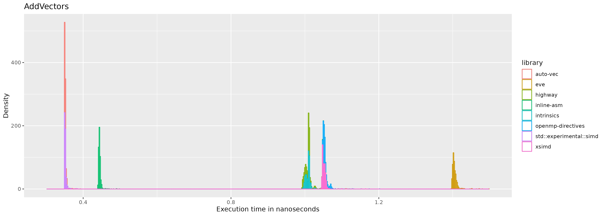
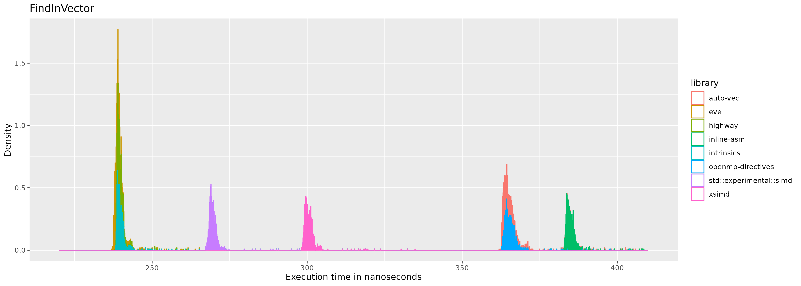

\vfill
<https://github.com/Liam-Weitzel/SIMD-Exploration>   
Liverpool Hope University   
School of Mathematics, Computer Science & Engineering   
04/24/2024   
\newpage

## Abstract

## Introduction

Vectorization is an old buzzword that has recently gotten a lot of attention in the worlds of graphics, AI, and big data. In part, the term ‘vectorization’ refers to the execution of a single instruction on multiple pieces of data at the same time. SIMD (‘Single instruction multiple data’) registers in the CPU are responsible for this. In contrast, the modern norm: the MIMD (‘Multiple instruction multiple data’) registers utilize multiple cores to achieve high degrees of parallelism and runs multiple instructions concurrently on multiple pieces of data. MIMD has proven extremely effective for increasing performance in general-purpose processing, particularly running lots of processes concurrently (Flynn, 1972). SIMD registers have a more specialized use case which can optimize a single process if used credibly. The terms SIMD, and MIMD are classifications for computer architectures (Flynn’s taxonomy) proposed by Michael J. Flynn in 1966. 

Consequently, modern x86 CPUs generally have many more MIMD registers than SIMD registers (Intel, 2023). The SIMD registers can be utilized with a specific instruction set. The two widely adopted standard instruction sets are the SSE instruction set and the Advanced Vector Extensions instruction set. These standards have various versions such as AVX128, AVX2, and AVX512 which introduce new and improved instructions with every iteration. Programs written in any modern programming language process statements, and hence the data being processed, in a scalar form by executing each statement according to a control flow. This is necessary because each statement processes data that has a dependency to this control flow. 

Therefore, to simplify for the purpose of this paper, vectorization is enabling a part of a program to process a single instruction N times simultaneously (vectorized) as opposed to processing that instruction N times consecutively (scalar).

The recent realization that Moore’s law no longer holds due to extreme heat build-up at higher CPU clock speeds has driven the shift toward multicore architectures (Etiemble, 2018). Furthermore, “the DRAM structures and interfaces have evolved to avoid a ‘memory wall’. However, even with a reduced memory CPI component, pipeline stalls due to memory waits still exist when executing a single program” (Etiemble, 2018). Indicating that even with the SIMD register’s ability to effectively process N statements simultaneously, N values still need to be loaded into the SIMD register. Thus the ‘memory wall’ as described by Etiemble, 2018 quickly becomes the new bottleneck instead of the clock speed. Regardless, SIMD technology can still increase our programs' performance although the expected N times increase is usually not visible due to the abovementioned limitations.

The present paper will compare and contrast the execution time of different SIMD programming paradigms that C++ developers have available to them when manipulating vectors. Furthermore, the present paper will explore the impact each paradigm has on portability, maintainability, and the development process whilst also discussing ongoing advancements in each. This topic is relevant since a notable amount of research and development has gone into SIMD registers and CPUs in recent years. However, the research addressing the application of these recent CPU developments is lacking. Whilst the developments in the CPU itself are important, the adoption of these developments is what leads to an increase in the general performance of programs as a whole.

## Literature Review

This literature review aims to explore all SIMD programming paradigms available in C++ as well as evaluate the current developments for each. Preliminary research suggests that the methods for writing vectorized code (programming paradigms) can be categorically divided into four distinct sections, namely: auto-vectorization, OpenMP directives, intrinsics, and high-level libraries. 

Through my exhaustive search on article databases such as Google Scholar and Jstor, a thorough examination of the existing literature was conducted. Despite SIMD being a well-researched area, it was observed that the literature regarding how to implement SIMD as a developer effectively was sparse. The paper “An Evaluation of Current SIMD Programming Models for C++” from the Technical University of Berlin (Pohl et al., 2016) stands out since it was the only paper found in this search that bears a resemblance to the aim and scope of the present paper. 

Pohl et al. (2016), similarly to this study, evaluates current SIMD programming paradigms, benchmarking each paradigm and weighing the benefits and disbenefits of each. While this paper provides foundational knowledge into the different SIMD programming paradigms available to C++ developers, there are distinct differences to the aim of the present paper. First and foremost, “An Evaluation of Current SIMD Programming Models for C++” primarily compares and contrasts well-established high-level libraries that facilitate SIMD programming by measuring execution time on various benchmarks. Contrarily, the present paper aims to evaluate high-level libraries as a whole, as a SIMD programming paradigm, and compare and contrast this paradigm against others (OpenMP Pragma directives, Auto-vectorization, and SIMD intrinsics). Furthermore, Pohl et al. (2016) evaluates each programming paradigm using graphics based benchmarks such as HEVC decoding. This process relies heavily on matrix multiplication. Conversely, the present paper aims to use simple vector based benchmarks to evaluate the performance in hopes of finding a more generalizable result.

### Auto-vectorization

Auto-vectorization is when the compiler generates assembly that makes use of the SIMD registers. This SIMD programming paradigm is practically equivalent to programming without the knowledge of the SIMD register’s existence. Thus making auto-vectorization the most maintainable and most portable SIMD programming paradigm because the written code does not change. Unfortunately, reviewing the implementation of popular static single-assignment (SSA) based compilers highlights that given the information a compiler has at compile time, it is impossible to perfectly auto-vectorize. James Rainders, a former developer of Intel’s C/C++ compiler (ICC) auto-vectorization feature mentioned in a C++ conference in 2016 that there is “No magic compiler coming soon” (Garland, J. 2023, May 8-12).

To answer the question of whether we can trust a compiler to vectorize our code, a basic understanding of how a compiler sees our code is required. The present paper is based on the models presented in Rastello et al. (2022) “SSA-based compiler design”. Given this understanding, a discussion of the vectorization methods used by popular compilers such as LLVM and GCC is discussed thoroughly in Wei et al. (2015). Wei et al. (2015) provides details about loop-level, function-level, and block-level optimization techniques used in compiler design to auto-vectorize our C++ code. Tayeb et al. (2023) discusses methods to improve auto-vectorization given irregular data access patterns. The IBM research report by Nuzman et al. (2005) discusses the challenges faced by auto-vectorizing compilers due to non-uniformity, limited data types, and memory access restrictions and provides an efficient method to handle non-contiguous data with power-of-2 strides while exploiting data reuse.

From reviewing the aforementioned sources, it is clear that automatic vectorization is a highly complex topic and has its limitations, and generally does not provide the performance increase that one would expect. To summarize, the primary reasons for this are:  
1. Taking Intel's SIMD extended instructions as an example, the execution time required to implement vectorization of one 16-bit operation is 1/2 of the time of eight 16-bit operations, not 1/8 as would be expected.   
2. The program itself calculates the constraints of the memory access ratio, and secondly, the program is divided into vectorizable parts and non-vectorizable parts. Constrained by Amdahl's law, The acceleration ratio is also limited by the proportion of vectorizable code in the application. When there are too many non-vectorizable parts of the program, the acceleration effect is still poor.   
3. Due to the limitations of program analysis and optimization technical capabilities, it is not all vectorizable parts of the program are discovered.  

By analyzing the implementation of auto-vectorization in GCC and LLVM, it is obvious that the SIMD compilation process is roughly divided into three parts. Namely, building the dependency graph, reasoning what optimizations can be made, and code generation. Building the dependency graph contains processes such as: converting code to compilers intermediate representation (SSA), In-lining, and clustering. Following this, the compiler can reason with the information gathered from the previous steps and perform loop-level optimization, block-level optimization, and function-level optimization. Due to the complexity of this topic, the given explanation presents a deliberate simplification to build a foundational model of auto-vectorization and its core principles.

### OpenMP directives flags

OpenMP (2012) defines their programming paradigm as: “The OpenMP API supports multi-platform shared-memory parallel programming in C/C++ and Fortran”. OpenMP provides a standardized set of Pragma directives which can provide the compiler with more context to aid in the automatic optimizations performed by the compiler. We can utilize OpenMP directives to leave a hint for the compiler to vectorize a certain section of the code using the flag `#pragma omp simd`. It is up to the compiler’s implementation to decide what to do with this hint.

From reviewing ICC’s documentation (Intel, 2023:678563), the market-leading and proprietary compiler from Intel, it is clear that the use of OpenMP SIMD directives to tell the compiler what code to vectorize has a strong effect (Breshears, 2020). In essence, the OpenMP SIMD directive will only have an effect when the ICC compiler observes an opportunity where a loop can be vectorized, but cannot be certain at compile time that vectorizing this loop would not change the order of execution. Other sources primarily praise OpenMP directives due to their ease of use and low impact on portability. "Compared to manually parallelizing the relevant code (e.g., using the pthreads library) or manually vectorizing the relevant code (e.g., using SIMD-intrinsics or assembly), annotating a loop with OpenMP pragmas yields much higher programmer productivity" (Kruse and Finkel, 2022).

### Intrinsics

Krukunas (2015:12.5.3) defines compiler intrinsics as “built-in functions provided by the compiler that share a one-to-one, or many-to-one, relationship with specific (assembly) instructions”. Intrinsics actual implementation is directly handled by the compiler. hence the burden of optimization is taken from the compiler to the developer. Unfortunately, due to the unstandardized nature of CPU’s SIMD instruction sets (Altivec, SSE, NEON etc.) writing a program with intrinsics is extremely dependent on its architecture. 

Intrinsics provide a middle ground between high-level C++ and low-level assembly, allowing programmers to write user-friendly and easy-to-understand code. While still allowing developers to interact directly with assembly instructions. This transparent use of SIMD instructions, without the use of assembly language, gives the programmer more control over the hardware, often resulting in significant performance improvements in specialized applications. 

Intrinsics can offer the best performance compared to other SIMD programming paradigms if used correctly but sacrifices portability, maintainability, and stability in turn due to its dependency on specific architectures and compilers. Intrinsics should not be used outside of high-performance computing applications. Apart from compromising maintainability and portability, their long names and complicated documentation increase the risk of bugs due to the potential for incorrect assumptions. This is the consensus observed from an analysis of various sources. Namely, the publication High Performance Programming by Jeffers et al. (2016) in the chapters: exploration of Quantum Chromodynamics, and Vectorization with AVX-512 intrinsics, recognizes the trade-off between performance and portability due to the architectural dependency. Similarly, Martin et al. (2023) in The Designer's Guide to the Cortex-M Processor Family states "The Cortex-M CPU supports saturated maths instructions which stick at their maximum and minimum values... If you want to use the saturated maths instructions, you have to access them by using compiler intrinsics or by using the CMSIS-Core functions...". Most notably, Krukunas (2015) in Power and Performance bluntly states that "Unfortunately, compiling intrinsics with GCC can be somewhat annoying.” and continues with a explanation detailing intrinsics lack of portability: “This stems from the fact that certain instruction sets can only be generated by the compiler when they are explicitly enabled in the CFLAGS. However, when the instruction sets are enabled in the CFLAGS, they are enabled to be generated everywhere, that is, there is no guarantee that all of the instructions will be protected by a CPUID check. For example, attempting to compile Intel AVX2 compiler intrinsics without the -mavx2 compiler flag will result in compilation failure."

Reinders et al. (2016) commends the active developments of ‘portable intrinsics’ alternatively referred to as high-level libraries. “Portable intrinsics can also provide a fast and effective way to develop and experiment with new or proposed hardware architectures. Instead of waiting for hardware availability and fully matured auto-vectorizers for an architecture, developers can use portable intrinsics to generate efficient vector code and take advantage of hardware emulators.” (Reinders et al., 2016).

### High-level libraries

The most popular approach to SIMD programming is to leverage already existing high-level C++ libraries. This method abstracts away intrinsics from the developer by detecting at compile time what architecture the program is being run on and consequently running the appropriate intrinsics given the architecture. This approach enables the use of intrinsics whilst supporting portability and maintainability. 

Many of these libraries take a specialized approach to applying SIMD by providing a tool that applies SIMD intrinsics to increase the performance of its processes. Interesting examples of such libraries:  
- ‘simdjson’ which is capable of “parsing gigabytes of JSON per second” (simdjson, 2024).  
- ‘sneller’ which is “World's fastest log analysis: Lamda + SQL + JSON + S3” (sneller, 2024).  
- ‘computeLibrary’ which is “a set of computer vision and machine learning functions optimised for both Arm CPUs and GPUs using SIMD technologies.” (computeLibrary, 2024).

The limitations of using high-level libraries are readily apparent. Due to the nature of how these libraries are created, the resulting size of an executable binary will be inflated with ‘dead’ code. Furthermore, due to the support for portability, and the unstandardized nature of SIMD registers, a lowest common denominator has to be established. As a result, high-level libraries may inadvertently constrain the full usage of more advanced and efficient features in newer architectures.

From the above we can conclude that the consensus regarding performance when it comes to high-level libraries is established to be significantly lower than the same implementations using intrinsics but significantly faster than auto-vectorized code. 

As announced by the C++ International Organization for Standardization (ISO) in their technical specification: ISO/IEC 19570, a high-level SIMD library is coming to the standard C++ library as std::simd in C++ 26. It is worth noting that the latest stable release of C++ is version 20 and the experimental release of C++ is 23. This addition to the C++ standard library is highly welcomed by the community and has gathered much traction even though the planned release is still far in the future. Intel has published an official response to the technical specification published by the C++ ISO where much feedback was shared and discussed. Intel being responsible for the market-leading C/C++ compiler (ICC), makes their feedback particularly valuable for the C++ ISO. The current implementation of the proposed high-level SIMD library to be added to the standard library can be found on Github.

### Measuring performance

To be able to measure the performance of a program one first has to define a metric. Carrington et al. (2005) concludes that using a simple and single metric to represent a high performance compute (HPC) workload is 'inadequate', and that the use of an aggregation of various simple metrics will also peform poorly. Nonetheless, the 'simple' metric floating point operations per seconds (flops) is often used. Numrich et al. (2004) proposes a new metric which is based on 'computational action'. "We examine work as it evolves in time and compute computational action as the integral of the work function over time. We compare the action generated at less than full power with the action that could have been generated at full power. We claim that the goal of performance optimization is to minimize lost, or wasted, action". Drawing inspiration from Pohl et al. (2016), the present paper aims to evaluate the different SIMD programming paradigms using execution time, not taking into consideration the efficiency of the program, effectively circumnavigating the unstandardized nature of 'perfomance'.

//TODO:  
Sources of error  
- Random vs systemic error  
- Random error is unavoidable so we need to use statistics!!  
- Why is it unavoidable?  
  - Hardware jitter:  
    - Intstruction pipelines: The pipeline fill level has an effect on the execution time for one instruction. Difference in CPU/memory bus clock cycles: The CPU clock cycle is different from the memory bus clock speed. Your CPU sometimes has to wait for the synchronization of memory accessess. CPU frequecy scaling and power management: These features cause heterogeneities in processing power. Shared hardware caches: Caches shared between multiple cores/ threads are subject to variance due to concurrent use. Larger memory segments may have variance in access times due to physical distance from CPU.  
  - Additionally, OS activities can cause non-determinism. Some hardware interrupts require OS handling immediately after delivery. Migration of non-pinned processes can affect the performance of CPU hueristics.  
SOURCE: https://www.chronox.de/jent/CPU-Jitter-NPTRNG.pdf (Müller, 2022)   
OBSERVER EFFECT ALERT!! any time we observe something we are also changing the result... Because we are adding stuff to measure which adds overhead... This is not a problem though for us as we are keeping the instrumentation the same across all tests and we aren't worried about actual execution_time. just how they relate to each other. What libs are there?
Hot vs cold performance, caching, branch preditiction. too many things can happen...
Find more sources for all these

## Research approach and methods

To evaluate which SIMD programming paradigm is the 'fastest', eight implementations of these paradigms were selected. The GNU Compiler Collection (GCC) was selected as the compiler for all benchmarks due to its popularity. Consequently, the implementation details of auto-vectorization and OpenMP directives are also handled by GCC. The specific libraries chosen to represent the 'high-level libraries' paradigm are: XSimd, EVE, Highway, and std::experimental::simd. 

XSimd is being used by major open-source projects, such as Mozilla Firefox, Apache Arrow, Pythran, and Krita. XSimd is actively being developed and has 68 core contributors at the time of writing.

EVE is a re-implementation of the old SIMD library by Falcou et al. (2019) named Boost.SIMD. Boost.SIMD before being made proprietary in 2019 due to disagreements in the community, was a very popular high-level SIMD library. Some of Boost.SIMD's core contributors have started working on EVE instead. Unlike XSimd, EVE has a tight group of 16 contributors.

Highway is an open source SIMD library actively being developed by Google. It has 3 to 4 commits per day, an impressive test suite, and works on the widest range of targets out of all libraries mentioned.

std::experimental::simd is an early beta version of the SIMD library mentioned in the literature review coming to the standard library (SIMDISO/IEC 19570) planned for C++ 26. This early beta was released for testing in 2018 and is actively being revised by the open source community.

Each benchmark is also implemented in assembly using the asm() function in C++. Using the hand written assembly implementation, the GCC compiled assembly of other SIMD programming paradigms can be compared and contrasted. Analyzing the low-level implementation will hopefully provide insight into the reason why one programming paradigm is faster than another.

Lastly, each benchmark will also be implemented using scalar/ un-vectorized code compiled using GCC, to serve as a baseline for our comparisons.

### Measurements

Google's benchmark library is used to measure and create each benchmark. This library abstracts complex low-level benchmark design to give a more userfriendly benchmarking experience. Google benchmark returns the execution time of a specified benchmark in nano seconds with 4 decimal places. Thus the uncertainty of our measurements are +- 0.5 femtoseconds or +- 0.00005 nanoseconds. Google benchmark's parameter `->MinTime(0.5)` is used to ensure that the execution time recorded is the execution time of the function running 'hot'. After the function being measured has ran continously for atleast 0.5 seconds, and the variance of the execution time between the last 10 executions is lower than a specified threshold, Google benchmark will return the last execution time. It is important to note that it does not return an aggregate of the execution time. Given this, the measurement process is repeated 1000 times using the argument `->Repetitions(1000)` for each benchmark.

Using the evirontment variables of the host system, we can control the output medium and format of Google benchmark. Before any benchmarks, these environment variables are defined to set the output format to `json` using: `export BENCHMARK_OUT_FORMAT=json`. The output medium (file or commandline) can be specified by setting the `BENCHMARK_OUT` environment variable to the file name.

The structure of the `json` output data can be seen in the example below:
```json
{
  "context": {
    "date": "2024-05-02T09:30:37+01:00",
    "host_name": "Liam-W-MacBookAir",
    "executable": "./auto-vec",
    "num_cpus": 4,
    "mhz_per_cpu": 1800,
    "cpu_scaling_enabled": false,
    "caches": [
      {
        "type": "Data",
        "level": 1,
        "size": 32768,
        "num_sharing": 2
      },
      {
        "type": "Instruction",
        "level": 1,
        "size": 32768,
        "num_sharing": 2
      },
      {
        "type": "Unified",
        "level": 2,
        "size": 262144,
        "num_sharing": 2
      },
      {
        "type": "Unified",
        "level": 3,
        "size": 3145728,
        "num_sharing": 4
      }
    ],
    "load_avg": [1.05273,1.02295,1.00195],
    "library_version": "v1.8.3-73-gbc946b91",
    "library_build_type": "release",
    "json_schema_version": 1
  },
  "benchmarks": [
    {
      "name": "BM_AddVectors/1/2/3/4/min_time:0.500/repeats:1",
      "family_index": 0,
      "per_family_instance_index": 0,
      "run_name": "BM_AddVectors/1/2/3/4/min_time:0.500/repeats:1",
      "run_type": "iteration",
      "repetitions": 1,
      "repetition_index": 0,
      "threads": 1,
      "iterations": 1986354156,
      "real_time": 3.5172534056940363e-01,
      "cpu_time": 3.5169191047318954e-01,
      "time_unit": "ns"
    }
  ]
}
```

In the example above, a total of `1986354156` executions were run in `0.5` seconds to ensure that the final measured execution time was measured 'hot'.

### Setup

The host system on which all measurements are taken has a 4 core Intel(R) Core(TM) i5-5350U CPU with a clock speed of 1.80GHz, 8GB of ram with a swappiness value of 60. It is likely, but completely untested, that any x86 CPU that understands the AVX2 instruction set will be able to execute and compile all benchmarks. Nonetheless, for purposes of reproducability, the binary for each benchmark is included in the project files, with which you can verify whether the assembly is equivalent.

The following list will outline the dependencies to run the benchmarks.  
1. The Linux operating system due to the utilization of bash scripts and linux specific command line interface (cli) tools.  
2. The cli tools xset and cpupower which can be installed on any os that uses the apt package manager using `$sudo apt-get install cpupower xset -y`.  
3. Git, and GCC v13: `$sudo apt-get install git gcc-13 -y`.  
4. The build tools Make, and CMake: `$sudo apt-get install make cmake -y`.  
5. Googletest: `$sudo apt-get install libgtest-dev -y`  
5. Highway:1.1.0 <https://github.com/google/highway>  
6. EVE:Perdita Quiescent <https://github.com/jfalcou/eve>  
7. Xsimd:13.0.0 <https://github.com/xtensor-stack/xsimd>  
8. std::experimental::simd:1.0.0 <https://github.com/VcDevel/std-simd>  
9. benchmark:1.8.3 <https://github.com/google/benchmark>  

As with any library in C++, each library needs to be built from source, using:  
```bash
$git clone github_repository_link.git
$cd github_repository_name && mkdir -p build && cd build
$cmake ..
$make -j && make test
```

Unfortunately, due to the large size of Highway, the host system was unable to build using `$make -j`. The build process would consistenly drain the available memory to <1 mb even when specifying to only use one core with `$make -j1`. The only option was to use my solid state drive as extra ram using swapfiles:   

```bash
$sudo fallocate -l 4G /tmp/swapfile  # Creates a 4 GB swap file
$sudo chmod 600 /tmp/swapfile       # Sets correct permissions
$sudo mkswap /tmp/swapfile          # Sets up the file as swap space
$sudo swapon /tmp/swapfile          # Enables the swap file

$make -j1

$sudo swapoff /tmp/swapfile
$sudo rm /tmp/swapfile
```

### Creating the benchmarks

To benchmark the execution time of the different programming paradigms, each paradigm will be used to implement an algorithm to solve 4 different vector manipulation problems. Each problem has multiple possible solutions. The first problem (BMAddVectors) is to add each element from two arrays storing 4 doubles that share the same index. Returning an array storing 4 doubles where each element is the sum of both input arrays at that elements index. The second problem (BMFindInVector & BMFindInVectorFaster) is to find the index of the first occurence of a target value in an array. This problem results in two different benchmarks as there are two SIMD algorithms commonly used to solve this problem. The third problem (BMSumVector) is to calculate the total sum of an array storing integers. Lastly, the fourth problem (BMReverseVector) is to reverse the order of each element in an array.

Accounting for the second problem resulting in two unique benchmarks, a total of 5 benchmarks will be used to compare the execution time of each programming paradigm.

Taking the first problem as an example, the scalar solution is implemented as such:
```c++
for(int i = 0; i < 4; ++i) {
  result[i] = data_a[i] + data_b[i];
}
```
The algorithms solving this problem are implemented using all selected implementations of the programming paradigms (Highway, EVE, Xsimd, etc). The solutions written using auto-vectorization, no vectorization, and OpenMP directives use the same logic but compile to completely different assembly. When writing this algorithm using intrinsics, assembly, or any high-level library however, the logic has to change significantly. This is because auto vectorized code, unvectorized code, and code written using OpenMP directives all use scalar logic. Contrarily, intrinsics, assembly, and SIMD libraries give you direct access to the SIMD assembly instructions meaning they cannot follow the same logic. As an example take the `__m256d` SIMD registers ability to store precisely 4 doubles (256 bits). Using the intrinsic function `_mm256_loadu_pd` we can load 4 doubles into our register. After loading all our data into the registers we can use `_mm256_add_pd` to add all 8 doubles together simultaneously in the same clock cycle. The complete intrinsics code:
```c++
__m256d a = _mm256_loadu_pd(&data_a[0]);
__m256d b = _mm256_loadu_pd(&data_b[0]);
__m256d r = _mm256_add_pd(a, b);
_mm256_storeu_pd(&result[0], r);
```
This same logic is also applied if you analyse the assembly of the auto-vectorized solution even though it was written with scalar logic. Consider an alternative algorithm where two vectors storing 3 doubles have to be added together. As the programmer, one can reason that padding both vectors with an extra 0 at the end will not change the outcome significantly and can adjust for this. However, compilers cannot. It becomes apparent that it is impossible to follow the same logic scalar solutions implement using vectorized solutions. Regardless, each solution to each problem in each paradigm was implemented making sure the output and logic was followed as closely as possible.

The problems were particularly selected because the optimal solution makes use of various specific AVX2 assembly instructions. Using this approach we are essentially testing whether each SIMD programming paradigm is effectively able to implement these specific AVX2 assembly instructions. The discussion includes a detailed breakdown of each problem and the algorithms implemented.

It is also important to note that each library and programming paradigm requires different compilation flags. As an example, when compiling the un-vectorized solution, passing flags which explicitly instruct GCC to auto-vectorize the code will result in a failed experiment. The exact command used to compile each solution is in a comment at the top of each implementation.

### Running the benchmarks

To run the experiment reproducibly, a bash script was written. The bash script first sets the cpu frequency to a 'performance' mode to reduce variation, ensures the cpu does not go to sleep during the experiment, and sets the aforementioned environment variables for Google benchmark. Then consecutively executing each benchmarks binary.
```bash
#!/bin/bash
sudo cpupower frequency-set --governor performance
xset s 0 0 -dpms
export BENCHMARK_OUT_FORMAT=json
export BENCHMARK_OUT=inline-asm-data
./inline-asm
export BENCHMARK_OUT=intrinsics-data
./intrinsics
export BENCHMARK_OUT=highway-data
./highway
export BENCHMARK_OUT=eve-data
./eve
export BENCHMARK_OUT=std::experimental::simd-data
./std::experimental::simd
export BENCHMARK_OUT=xsimd-data
./xsimd
export BENCHMARK_OUT=openmp-directives-data
./openmp-directives
export BENCHMARK_OUT=auto-vec-data
./auto-vec
export BENCHMARK_OUT=no-vec-data
./no-vec
sudo cpupower frequency-set --governor powersave
xset s 60 60 +dpms
```

Finally, to run the experiment use the commands:
```
$sudo chmod 777 benchmark.sh
$sudo ./benchmark.sh
```

## Results

### The metrics

As mentioned in the methodology, the execution time of each solution was measured. To compare each solution, the median of the unvectorized solutions execution time was used as a baseline. Dividing the unvectorized solutions median by all other results of all other solutions in that benchmark results in the 'speed up' over the baseline. This metric was not used in any statistical test, only for representation.

Brief analysis of the data reveals that the variance of the execution time of each solution was not normally distributed, but instead heavily positively skewed. Furthermore, the variance was not homogeneous thus a nonparametric test is required. The nonparametric Kruskal-Wallis test assumes non-normally distributed data, non-homogeneous variance, two or more independent groups, similar distribution across groups, and randomly selected independent samples. These assumptions are similar to the popular Mann-Whitney U test, as the Kruskal-Wallis test is the same as the Mann-Whitney U test but designed for more than two independent samples. Hence, the Kruskal-Wallis test was used to determine whether the population medians are equal (null hypothesis).

\newpage
### Benchmark: Add vectors

\begin{center}
Figure 1. Median speed up of the solutions written with each programming paradigm implementation (library) over the unvectorized baseline solution to the 'add vectors' problem.
\end{center}
  

Figure 1 indicates that the solution compiled using auto vectorization, and the solution written using the std::experimental::simd library executed 4.0x faster than the unvectorized solution. The solution written using the EVE library had the same median execution time (1.002x) as the unvectorized solution. The solutions written using: OpenMP directives, highway, intrinsics, and xsimd all exhibited between a 1.33x and a 1.39x increase in execution time over the unvectorized solution. Lastly, the solution written using inline assembly executed 3.17x faster than the unvectorized solution.

\begin{center}
Figure 2. Histogram of execution time, grouped by the solutions written in each programming paradigm implementation (library) to the 'add vectors' problem.
\end{center}
  

Figure 2 gives an indication that the execution times are not normally distributed, and the variances are not equal (Levene: p-value < 2.2e-16). Furthermore, figure 2 indicates that the population medians are not equal (Kruskal-Wallis: p-value < 2.2e-16).

### Benchmark: Find in vector

\begin{center}
Figure 3. Median speed up of the solutions written with each programming paradigm implementation (library) over the unvectorized baseline solution to the 'find in vector' problem using the sub-optimal algorithm.
\end{center}
  

Figure 3 indicates that the solutions written using EVE, Highway, and intrinsics executed between 10.59 and 10.63x faster than the unvectorized solution. The solution written using std::experimental::simd executed 9.4x faster than the unvectorized solution. The solution written using Xsimd executed 8.44x faster than the unvectorized solution. Lastly, the solution compiled with auto-vectorization and the solutions written using inline assembly and OpenMP directives all executed between 6.59 and 9.96x faster than the unvectorized solution. Contrary to expectation, the solution written using inline assembly executed the slowest in this comparison. This is likely due to human error.

\begin{center}
Figure 4. Histogram of execution time, grouped by the solutions written in each programming paradigm implementation (library) to the 'find in vector' problem using the sub-optimal algorithm.
\end{center}
  

Figure 4 gives an indication that the execution times are not normally distributed, and the variances are not equal (Levene: p-value < 2.2e-16). Furthermore, figure 2 indicates that the population medians are not equal (Kruskal-Wallis: p-value < 2.2e-16).

### Benchmark: Find in vector faster

\begin{center}
Figure 5. Median speed up of the solutions written with each programming paradigm implementation (library) over the unvectorized baseline solution to the 'find in vector' problem using the optimal algorithm.
\end{center}
  

Contrary to figure 3, figure 5 depicts rather expected results. The optimal algorithm which can only be implemented using SIMD logic directly was used in this benchmark, explaining the sudden observed disparity between the paradigms which use scalar and simd logic. The solutions written using EVE, Highway, and inline assembly executed between 15.54x and 16.32x faster than the unvectorized solution. Interestingly, the solution written using intrinsics executed 13.9x faster than the unvectorized solution. Both the solutions written using std::experimental::simd and xsimd libraries executed 11.10-11.19x faster than the unvectorized solution. Lastly, both the auto vectorized and OpenMp directives solutions executed 6.94-9.96x faster than the unvectorized solution.

\begin{center}
Figure 6. Histogram of execution time, grouped by the solutions written in each programming paradigm implementation (library) to the 'find in vector' problem using the optimal algorithm.
\end{center}
  

Figure 6 gives an indication that the execution times are not normally distributed, and the variances are not equal (Levene: p-value < 2.2e-16). Furthermore, figure 2 indicates that the population medians are not equal (Kruskal-Wallis: p-value < 2.2e-16).

### Benchmark: Reverse vector

\begin{center}
Figure 7. Median speed up of the solutions written with each programming paradigm implementation (library) over the unvectorized baseline solution to the 'reverse vector' problem.
\end{center}
  

Similarly to the last benchmark, Figure 7 reveals that the problem of reversing a vector can benefit from programming using SIMD logic directly. This was not observed with all the SIMD libraries as std::experimental::simd interestingly executed 0.375x faster than the unvectorized code. The solutions compiled using auto-vectorization and OpenMP directives executed between 7.145x and 7.112x faster than the unvectorized solution. The solutions written using EVE, and Highway executed between 8.167x and 8.175x faster than the unvectorized solution. The solutions written using intrinsics and Xsimd executed between 7.98 and 7.53x faster than the unvectorized solution. Lastly, the solution written using inline assembly executed 6.192x faster than the unvectorized solution.

\begin{center}
Figure 8. Histogram of execution time, grouped by the solutions written in each programming paradigm implementation (library) to the 'reverse vector' problem.
\end{center}
  

std::experimental::simd is excluded from figure 8 to prevent warping the scale as the median execution time (4110 nanoseconds) was lower than the unvectorized solutions median execution time (1540 nanoseconds). Figure 8 gives an indication that the execution times are not normally distributed, and the variances are not equal (Levene: p-value < 2.2e-16). Furthermore, figure 2 indicates that the population medians are not equal (Kruskal-Wallis: p-value < 2.2e-16).

### Benchmark: Sum vector

\begin{center}
Figure 9. Median speed up of the solutions written with each programming paradigm implementation (library) over the unvectorized baseline solution to the 'sum vector' problem.
\end{center}
  

Contrary to the last benchmark, the solution implemented using std::experimental::simd boasts an execution time 16.59x faster than the unvectorized solution. The solutions implemented using EVE, Highway, Intrinsics, and Xsimd executed between 12.28x and 12.38x faster than the unvectorized solution. The solutions compiled using auto-vectorization, and OpenMP directives executed between 8.4x and 8.548x faster than the unvectorized solution. Lastly and suprisingly, the solution written using inline assembly executed 6.72x faster than the unvectorized solution, again likely due to human error.

\begin{center}
Figure 10. Histogram of execution time, grouped by the solutions written in each programming paradigm implementation (library) to the 'sum vector' problem.
\end{center}
  

Figure 10 gives an indication that the execution times are not normally distributed, and the variances are not equal (Levene: p-value < 2.2e-16). Furthermore, figure 2 indicates that the population medians are not equal (Kruskal-Wallis: p-value < 2.2e-16).

//TODO: Find out how verbose I should be when describing the figures. Using words like 'speed up' altough un-academic would shorten these paragraphs and make them a lot more legible. Now on second thought, using words like speed up, increase over baseline, AND 'faster than the unvectorized solution' will be very confusing for the reader. Keep it consistent. It reaaaally doesn't flow, looks like its copy pasted from some script... How to fix? 

//NOTE: You can also just do the description of the histogram figures only once as they are all (almost) identical.

//TODO: Mention that the raw data and analysis R script are both in the project files ;)

## Discussion

To be able to form an accurate conclusion, the reason behind the observed change in execution time when writing a solution using different SIMD programming paradigms has to be discussed. The following section will breakdown the assembly instructions of each solution in each benchmark. Comparing the assembly instructions of each solution gives us a common denominator with which we can deduce the reason for the observed change in execution time. In the interest of brevity, only the assembly instructions forming the loop where the majority of execution time is spent will be compared, this section of a benchmark is also referred to as the 'hot loop'. The cli tool `objdump` was used with the arguments `-drwC -Mintel -S foo.o | less` to generate human readable assembly code for any given binary, in this example `foo.o`.

### Benchmark: Add vectors

The first problem 'add vectors' requires each programming paradigm implementation (library) to add each index of the two arrays:
```c++
double data_a[4] = {1.0,2.0,3.0,4.0};
double data_b[4] = {1.0,2.0,3.0,4.0};
```
Then to store the result in `double result[4]` to give:
```c++
double result[4] = {2.0,4.0,6.0,8.0};
```

The optimal solution using scalar logic is to iterate from 0 to 4, and set `result[i] = data_a[i] + data_b[i]`. When using vectorized logic the optimal solution changes since we are able to process a Single Instruction across Multiple pieces of Data (S.I.M.D) in one clock cycle. Using the AVX2 instruction set, we can load all four doubles into a 256 bit register using the intrinsic function `__m256d a = _mm256_loadu_pd(&data_a[0])`. Doing this for both `data_a` and `data_b` allows us to use the intrinsic function `_m256d r = _mm256_add_pd(a, b)` to add each value in each register together to solve the problem. Finally, `_mm256_storeu_pd(&result[0], r)` stores the result into our `result` array. 

Translating the intrinsic functions into assembly we can see that not every intrinsic function maps to one assembly instruction. For example, loading and storing each value into a 256 bit register takes four `vmovsd` assembly instructions. The only intrinsic function which maps to a single assembly instruction in the aforementioned solution is `_mm256_add_pd` mapping directly to `vaddpd`.

Instead the optimal unvectorized solution uses the assembly instruction `movsd` twice to load one value from both the input arrays into a 64 bit register. Then using `addsd` both registers can be summed and stored into the result using another `movsd` instruction. Repeating this process four times gives us the desired result.

From this we can logically deduce that a theoretical execution time using SIMD instructions should be 4x faster than the unvectorized solution. This is precisely what was observed in figure 1 where both the auto-vectorized solution as well as the solution written using std::experimental::simd executed 4x faster than the unvectorized solution.

Analyzing the assembly of each compiled solution reveals that all vectorized solutions are making use of the `vaddpd` assembly instruction and use the optimal approach. Infact, the solutions written using: Highway, std::experimental::simd, Xsimd, and intrinsics compiled to practically identical assembly:

```assembly
Highway:
    mov     rax,rbx
    nop     DWORD PTR [rax+0x0]
    vmovupd ymm4,YMMWORD PTR [rsp+0x30]
    vaddpd  ymm0,ymm4,YMMWORD PTR [rsp+0x10]
    vmovupd YMMWORD PTR [rsp+0x50],ymm0
    dec     rax

std::experimental::simd:
    mov     rax,rbx
    nop     DWORD PTR [rax+0x0]
    vmovapd xmm2,XMMWORD PTR [rsp+0x20]
    vaddpd  xmm0,xmm2,XMMWORD PTR [rsp]
    vmovapd XMMWORD PTR [rsp+0x40],xmm0
    dec     rax

Xsimd:
    mov     rax,rbx
    nop     DWORD PTR [rax+0x0]
    vmovupd ymm2,YMMWORD PTR [rsp+0x10]
    vaddpd  ymm0,ymm2,ymm2
    vmovupd YMMWORD PTR [rsp+0x30],ymm0
    dec     rax

intrinsics:
    mov     rax,rbx
    nop     DWORD PTR [rax+0x0]
    vmovupd ymm4,YMMWORD PTR [rsp+0x30]
    vaddpd  ymm0,ymm4,YMMWORD PTR [rsp+0x10]
    vmovupd YMMWORD PTR [rsp+0x50],ymm0
    dec     rax
```

It is important to note that these libraries had largely varying execution times as seen in figure 1 and 2. Suprisingly, the auto-vectorized solution used more assembly instructions, thus likely more clock cycles, but boasts the fastest median execution time.

```assembly
Auto-vec:
    vxorps      xmm1,xmm1,xmm1
    mov         rdx,QWORD PTR [rsp+0x18]
    mov         rax,rbx
    vcvtsi2sd   xmm2,xmm1,r15
    vcvtsi2sd   xmm0,xmm1,rdx
    vmovsd      xmm3,xmm2,xmm2
    vcvtsi2sd   xmm2,xmm1,r14
    vcvtsi2sd   xmm1,xmm1,r13
    vunpcklpd   xmm0,xmm0,xmm3
    vunpcklpd   xmm1,xmm2,xmm1
    vinsertf128 ymm0,ymm0,xmm1,0x1
    vaddpd      ymm0,ymm0,ymm0
    nop         DWORD PTR [rax+0x0]
    vmovapd     YMMWORD PTR [rsp+0x20],ymm0
    dec         rax
```

This indicates that the implementation of the algorithm is not the only factor affecting the execution time. It is likely that due to the simplicity of this problem, the execution time was largely influenced by the overhead of loading the library used to implement the solution. The solutions compiled using auto-vectorization and written using std::experimental::simd executed the fastest, further supporting this theory. Auto-vectorization has no overhead due to it being a compilation process. Simlarly, std::experimental::simd is a small library comparitavely to the other libraries tested and is part of the standard libray. However, the median execution time of the solution compiled using OpenMP directives does not align with this theory.

### Benchmark: Find in vector

The second problem 'find in vector' requires each implementation of each programming paradigm (library) to find a value `target = 456` in an array of size `4096` and store it in the variable `res`. The target value is always located on the 3254th index of the array.

```C++
  int target = 456;
  int N = 4096;
  int vector[N];
  std::fill(vector, vector + N, 0);
  vector[3254] = target;
  int res = -1;
```

The optimal solution using scalar logic is to do an iterative search through the array:
```C++
  for (int i = 0; i < N; ++i) {
    if(vector[i] == target) {
      res = i;
      break;
    }
  }
```

The sub-optimal approach using SIMD logic utilizes the SIMD concept of masking. The first step is to store 8 copies of the target value in a 256 bit register. Next we will iterate `4096` times but with an increment of 8. Every iteration we will load 8 integers into a 256 bit register. Using the assembly instruction `vpcmpeqd` we are able to compare the integers in the target vector against the newly loaded vector containing the 8 current values. `vpcmpeqd` returns a mask where any equal values are set to 1 and unequal values are set to 0. Using the assembly instruction `vmovmskps` which takes a large 32 bit mask and reduces it to an 8 bit mask, essentially returning 1 if any value in the mask is 1. From this, we can deduce if the target is within the current block of 8 integers. Lastly, using the assembly instructin `tzcnt` to get the index of the first 1 within the mask by counting the trailing zeros.

The proposed solution in assembly using SIMD instructions alongside comments for clarity:
```Assembly
  movd [target], xmm0            // Move target into xmm0 register
  vpermilps $0, xmm0, xmm0       // Duplicate the target integer across xmm0 register

  // Initialize loop variables
  xor eax, eax                   // Clear eax register for loop index

  .p2align 4                     // Align loop entry point to 16 bytes
  1:
  vmovdqu ([vec], rax, 4), ymm1  // Load 8 integers from vector
  vpcmpeqd ymm0, ymm1, ymm2      // Compare 8 integers with target
  vmovmskps ymm2, edx            // Move comparison mask to edx register

  test edx, edx                  // Test if any bits are set
  jz 2f                          // Jump to next iteration if none are set

  tzcnt edx, edx                 // Count trailing zeros in mask
  add eax, edx                   // Add base index to the bit position
  mov edx, [res]                 // Move result to output variable
  jmp 3f                         // Jump to end

  2:
  add $8, eax                    // Increment loop index
  cmp [N], eax                   // Compare with N
  jl 1b                          // Jump back if not reached end
```

This approach was used to implement all SIMD solutions for this benchmark. Analyzing the assembly of each compiled solution reveals that all vectorized solutions are able to correctly make use of the `vpcmpeqd` assembly instruction and were able to somewhat recreate this approach. Contrary to 'add vectors' benchmark, the overall structure of the 'hot loop' of each solution is significantly different. Notably, the solutions compiled using auto-vectorization, written using OpenMP directives and Xsimd were not able to make use of the `vmovmskps` and `tzcnt` assembly instructions but instead used `vptest` followed by an iterative search to accomplish the same outcome. As depicted in figure 3, the solutions compiled using auto-vectorization, written using OpenMP directives and Xsimd also executed among the slowest.

### Benchmark: Find in vector faster

The 'find in vector faster' benchmark requires each programming paradigm implementation (library) to solve the same problem as the previous benchmark 'find in vector' but using the optimal approach. The primary difference is using `vptest` instead of `vmovmskps`. Much like the scalar assembly instruction `test`, `vptest` tests if all elements in the 256 bit register are 0 by performing a bitwise AND. This by itself does not decrease the execution time, but both `vptest` and `vmovmskps` are bottlenecks in the hot loop. Due to the subtle change in the test logic we are now able to group neighbouring iterations of the loop together using bitwise OR and test them simultaneously using `vptest`. In theory, this greatly relieves pressure from the bottleneck. Instead of checking if 8 integers are equal to the target per iteration in the previous sub-optimal approach, the optimal approach is checking 32 integers per iteration.

The annotated solution implemented using intrinsics for clarification:
```C++
void BM_FindInVectorFaster() {
  int target = 456;
  int N = 4096;
  int vector[N];
  std::fill(vector, vector + N, 0);
  vector[3254] = target;
  int res = -1;

  __m256i x = _mm256_set1_epi32(target); //Loading target and duplicating across register
  for (int i = 0; i < N; i += 32) {
    __m256i y1 = _mm256_load_si256((__m256i*) &vector[i]); //Load the first 8 ints
    __m256i m1 = _mm256_cmpeq_epi32(x, y1); //Comparing the first 8 ints against target

    __m256i y2 = _mm256_load_si256((__m256i*) &vector[i + 8]); //Loading the next 8 ints
    __m256i m2 = _mm256_cmpeq_epi32(x, y2); //Comparing the next 8 ints against target

    __m256i y3 = _mm256_load_si256((__m256i*) &vector[i + 16]); //Loading the next 8 ints
    __m256i m3 = _mm256_cmpeq_epi32(x, y3); //Comparing the next 8 ints against target

    __m256i y4 = _mm256_load_si256((__m256i*) &vector[i + 24]); //Loading the next 8 ints
    __m256i m4 = _mm256_cmpeq_epi32(x, y4); //Comparing the next 8 ints against target

    __m256i m12 = _mm256_or_si256(m1, m2); //Combining resulting masks using bitwise or
    __m256i m34 = _mm256_or_si256(m3, m4); //Combining resulting masks using bitwise or
    __m256i m = _mm256_or_si256(m12, m34); //Combining resulting masks using bitwise or

    if(!_mm256_testz_si256(m, m)) { //Testing if the final combined mask contains a 1
      //Find the target within this 32 int block using previous approach
    }
  }
}
```

This approach was used to implement all SIMD solutions for this benchmark. Analyzing the assembly of each compiled solution reveals that all vectorized solutions are able to correctly make use of the `vptest` assembly instruction, but only the solutions written using programming paradigm implementations (libraries) allowing the use of SIMD logic directly were able to use the bitwise OR grouping method. Figure 5 verifies this visually. The two solutions compiled using auto-vectorization and OpenMP directives, which use scalar logic, executed the slowest.

### Benchmark: Reverse vector

The 'reverse vector' benchmark requires each programming paradigm implementation (library) to reverse each element in an array of size `4096`. The optimal scalar approach iterates over half the elements in the array swapping the elements at index `[i]` and `[4096 - i - 1]` at every iteration.

```C++
void BM_ReverseVector() {
  int N = 4096;
  int vector[N];
  std::iota (vector, vector + N, 0);

  for (int i = 0; i < N / 2; ++i)
    std::swap(vector[i], vector[N - i - 1]);
}
```

To solve this problem using SIMD logic we require permutations. The assembly instruction `vpshufd` copies each element from a source (first operand) to a destination (second operand) in an order specified in the third operand. Using this SIMD assembly instruction we are able reverse 8 integers simultaneously by specifying the order as `{7,6,5,4,3,2,1}`. Following this we can apply the same logic as in the scalar approach.

The annotated solution implemented using intrinsics for clarification:
```C++
void BM_ReverseVector() {
  int N = 4096;
  int vector[N];
  std::iota (vector, vector + N, 0);

  //Initialize the order for the reverse permutation
  const __m256i reversePermutation = _mm256_setr_epi32(7,6,5,4,3,2,1,0);

  for (int i = 0; i < N / 2; i += 8) {
    //Load the next 8 ints from the start
    __m256i x = _mm256_loadu_si256((__m256i*) &vector[i]);

    //Load the next 8 ints from the back
    __m256i y = _mm256_loadu_si256((__m256i*) &vector[N - i - 8]);

    _mm256_permutevar8x32_epi32(x, reversePermutation); //Reverse x
    _mm256_permutevar8x32_epi32(y, reversePermutation); //Reverse y

    _mm256_storeu_si256((__m256i*) &vector[N - i - 8], x); //Store x in y's place
    _mm256_storeu_si256((__m256i*) &vector[i], y); //Store y in x's place
  }
}
```

Due to the similarity between the scalar and vectorized approach it is possible to logically deduce that a theoretical execution time using SIMD instructions should be 8x faster than the unvectorized solution. This is precisely what was observed in figure 7 where the solutions implemented using EVE, Highway and intrinsics executed 8x faster than the unvectorized solution.

Analyzing the assembly of each compiled solution reveals that not all vectorized solutions are making use of the `vpshufd` assembly instruction as expected. Infact, the solutions written using EVE, Highway, intrinsics, and Xsimd compiled to practically identical assembly which does not include the `vpshufd` assembly instruction. Nonetheless, the aforementioned solutions are all executed among the fastest in this benchmark. It is possible that because the vector is reversed in-place, and never explicitly stored back in memory, that the compiler optimized this away.

```
EVE:
    nop     DWORD PTR [rax+rax*1+0x0]
    vmovdqu ymm1,YMMWORD PTR [rdx-0x20]
    vmovdqu ymm0,YMMWORD PTR [rbx+rax*4]
    sub     rdx,0x20
    vmovdqu YMMWORD PTR [rbx+rax*4],ymm1
    add     rax,0x8
    vmovdqu YMMWORD PTR [rdx],ymm0
    cmp     ecx,eax

Highway:
    nop     DWORD PTR [rax+rax*1+0x0]
    vmovdqa ymm1,YMMWORD PTR [rdx-0x20]
    vmovdqa ymm0,YMMWORD PTR [rbx+rax*4]
    sub     rdx,0x20
    vmovdqa YMMWORD PTR [rbx+rax*4],ymm1
    add     rax,0x8
    vmovdqa YMMWORD PTR [rdx],ymm0
    cmp     ecx,eax

intrinsics:
    nop     DWORD PTR [rax+rax*1+0x0]
    vmovdqu ymm0,YMMWORD PTR [rdx-0x20]
    vmovdqu ymm1,YMMWORD PTR [rbx+rax*4]
    sub     rdx,0x20
    vmovdqu YMMWORD PTR [rdx],ymm1
    vmovdqu YMMWORD PTR [rbx+rax*4],ymm0
    add     rax,0x8
    cmp     ecx,eax

Xsimd:
    nop     DWORD PTR [rax+rax*1+0x0]
    vpermd  ymm2,ymm0,YMMWORD PTR [rdx-0x20]
    vpermd  ymm1,ymm0,YMMWORD PTR [rbx+rax*4]
    sub     rdx,0x20
    vmovdqa YMMWORD PTR [rbx+rax*4],ymm2
    add     rax,0x8
    vmovdqa YMMWORD PTR [rdx],ymm1
    cmp     ecx,eax
```

The excluded solution written using std::experimental::simd compiled strangely. The hot loop contains an excessive amount of instructions not required nor explicitly implemented in the C++ code. Only the solutions compiled using auto-vectorization and OpenMP directives followed the expected optimal approach. Similarly to the previous benchmark, the solutions written using programming paradigm implementations (libraries) allowing the use of SIMD logic directly executed the fastest.

### Benchmark: Sum vector

Lastly, the 'sum vector' benchmark requires each programming paradigm implementation (library) to sum each element in an array of size `4096`. The optimal scalar approach iterates over all elements in the array, adding each element `[i]` to the variable `int res` at every iteration. 

```C++
void BM_SumVector() {
  int N = 4096;
  int vector[N];
  std::iota (vector, vector + N, 0);
  int res = 0;

  for( int i = 0; i < N; ++i ) {
    res += vector[i];
  }
}
```

The accumulator variable `int res` has to be updated before the next iteration can begin, largely preventing vectorization by adding a dependency between iterations. To resolve this, we can logicaly split the array into eight interleaved partitions to create 8 partial sums (vertical summation), which then sum to the final sum using horizontal summation. We can arbitrarily partition the array to further to remove dependency between iterations.

The annotated intrinisics code for clarity:
```C++
void BM_SumVector() {
  int N = 4096;
  int vector[N];
  std::iota (vector, vector + N, 0);
  int res = 0;

  // Initialize two 256-bit integer vectors to zero to store partial sums.
  __m256i s1 = _mm256_setzero_si256();
  __m256i s2 = _mm256_setzero_si256();

  // Loop through the array in steps of 16
  // processing two blocks of 8 integers each iteration.
  for (int i = 0; i < N; i += 16) {
    // Add the next block of 8 integers to the first sum vector.
    s1 = _mm256_add_epi32(s1, _mm256_load_si256((__m256i*) &vector[i]));
    // Add the subsequent block of 8 integers to the second sum vector.
    s2 = _mm256_add_epi32(s2, _mm256_load_si256((__m256i*) &vector[i + 8]));
  }

  // Combine the two partial sum vectors into a single vector.
  __m256i s = _mm256_add_epi32(s1, s2);
  // Allocate space for 8 integers to store the combined sums.
  int t[8];

  // Store the combined sums from the SIMD register to the array.
  _mm256_storeu_si256((__m256i*) t, s);
  
  // Sum the elements of the temporary array to get the final result.
  for (int i = 0; i < 8; ++i) 
    res += t[i];
}
```

Due to the similarity between the scalar and vectorized approach it is possible to logically deduce that a theoretical execution time using SIMD instructions should be 16x faster than the unvectorized solution. This is precisely what was observed in figure 9 where the solution implemented using std::experimental::simd executed 16.59x faster than the unvectorized solution.

Analyzing the assembly of each compiled solution reveals that not all vectorized solutions are making use of the optimal approach. Again, the solutions compiled using auto-vectorization and OpenMP directives used an alternative approach with a slower median execution time. Similarly to the previous benchmark, the solutions written using EVE, Highway, intrinsics, and Xsimd compiled to practically identical assembly using the optimal approach. Suprisingly, the fastest solution implemented using std::experimental::simd foregoes two assembly instructions in its hot loop and is still able to produce a correct result.

```
EVE:
    vpaddd  ymm3,ymm2,YMMWORD PTR [rax]
    vpaddd  ymm0,ymm1,YMMWORD PTR [rax+0x20]
    add     rax,0x40
    vmovdqa ymm2,ymm3
    vmovdqa ymm1,ymm0
    cmp     rax,rcx

Highway:
    vpaddd  ymm3,ymm2,YMMWORD PTR [rax]
    vpaddd  ymm0,ymm1,YMMWORD PTR [rax+0x20]
    add     rax,0x40
    vmovdqa ymm2,ymm3
    vmovdqa ymm1,ymm0
    cmp     rax,rcx

Xsimd:
    vpaddd  ymm3,ymm2,YMMWORD PTR [rax]
    vpaddd  ymm0,ymm1,YMMWORD PTR [rax+0x20]
    add     rax,0x40
    vmovdqa ymm2,ymm3
    vmovdqa ymm1,ymm0
    cmp     rax,rcx

intrinsics:
    vpaddd  ymm3,ymm1,YMMWORD PTR [rax]
    vpaddd  ymm0,ymm2,YMMWORD PTR [rax+0x20]
    add     rax,0x40
    vmovdqa ymm1,ymm3
    vmovdqa ymm2,ymm0
    cmp     rax,rcx

std::experimental::simd:
    vpaddd ymm1,ymm1,YMMWORD PTR [rax]
    vpaddd ymm0,ymm0,YMMWORD PTR [rax+0x20]
    add    rax,0x40
    cmp    rax,rcx
```

Similarly to the three previous benchmarks, the solutions written using programming paradigm implementations (libraries) allowing the use of SIMD logic directly executed the fastest.

## Conclusion

All benchmarks except the first 'add vectors' benchmark exhibited that the solutions written using programming paradigm implementations allowing the use of SIMD logic directly executed the fastest. From the solutions written using SIMD logic, the solutions written using high-level libraries consistenly executed slightly faster than the solutions written using intrinsics and inline assembly. Excluding the first benchmark, the solutions compiled using auto-vectorization and OpenMP directives consistently executed among the slowest. This result is expected and aligns well with the consensus of existing literature. Seemingly, given that the problem is sufficiently complex, solutions written using intrinsics and inline assembly can offer similar, if not faster, execution time than high-level libraries. Nonetheless, writing the solution using intrinsics or inline assembly is much more prone to error, significantly less portable, and definitely less maintainable.

The present paper aims to compare and contrast the execution time of different SIMD programming paradigms that C++ developers have available to them when manipulating vectors. The results and the following discussion correctly and thoroughly compare and contrast the execution time of different SIMD programming paradigms. Furthermore, all programming paradigms were benchmarked using simple vector manipulation problems. Unfortunately, to provide a definitive answer to the research question: "Which SIMD programming paradigm in C++ is the fastest benchmarked on various vector manipulation algorithms?" significantly more benchmarks are required. Seemingly, the answer to this question heavily depends on the complexity of the problem and host system. The conclusions deduced in the present paper are only valid for the benchmarks from which the deductions are made.

SIMD programming is critical in performance optimization. Although auto-vectorization provides significant performance gains with minimal effort, to fully exploit the possible perfomance gain of SIMD, direct application of SIMD logic is essential. Unfortunately, this demands a deep understanding of SIMD and careful implementation to avoid potential pitfalls.

## Bibliography

Garland, J. (2023, May 8-12) SIMD Libraries in C++ [Conference Presentation]. CppNow 2023, Aspen, Colorado, United States 

Breshears, C. (2020). How to Use the OpenMP Single Instruction Multiple Data (SIMD) Directive to Tell the Compiler What Code to Vectorize. [Online]. Intel.com. Available at: https://www.intel.com/content/www/us/en/developer/articles/technical/delve-into-mysteries-openmp-vec [Accessed 2 February 2024].

Cppreference. (2018). SIMD library. [Online]. cppreference. Available at: https://en.cppreference.com/w/cpp/experimental/simd [Accessed 2 February 2024].

Etiemble, D., 2018. 45-year CPU evolution: one law and two equations. arXiv preprint arXiv:1803.00254.

GNU foundation. (n/a). 6.54 Using Vector Instructions through Built-in Functions. [Online]. gcc. Available at: https://gcc.gnu.org/onlinedocs/gcc/Vector-Extensions.html [Accessed 2 February 2024].

Intel. (2023). Intel® Core™ Ultra Processor Datasheet. Intel. 1(n/a). [Online]. Available at: https://www.intel.com/content/www/us/en/content-details/792044/intel-core-ultra-processor-datasheet- [Accessed 2 February 2024].

ISO/IEC. (2018). Programming Languages — Technical Specification for C++ Extensions for Parallelism. International Organization for Standardization. n/a(ISO/IEC TS 19570). [Online]. Available at: https://webstore.iec.ch/preview/info_isoiects19570%7Bed2.0%7Den.pdf [Accessed 2 February 2024].

Jeffers, J., Reinders, J. and Sodani, A., 2016. Intel Xeon Phi processor high performance programming: knights landing edition. Morgan Kaufmann.

Kruse M, Finkel H. A proposal for loop-transformation pragmas. InEvolving OpenMP for Evolving Architectures: 14th International Workshop on OpenMP, IWOMP 2018, Barcelona, Spain, September 26–28, 2018, Proceedings 14 2018 (pp. 37-52). Springer International Publishing.

Kukunas, J., 2015. Power and performance: Software analysis and optimization. Morgan Kaufmann.

Kusswurm, D. (2022). Modern Parallel Programming with C++ and Assembly Language. Canada: Apress Berkeley.

llvm. (n/a). Auto-Vectorization in LLVM. [Online]. llvm.org. Available at: https://llvm.org/docs/Vectorizers.html [Accessed 2 February 2024].

Martin, T., 2022. The designer's guide to the Cortex-M processor family. Newnes.

Microsoft. (2022). x86 intrinsics list. [Online]. Microsoft. Available at: https://learn.microsoft.com/en-us/cpp/intrinsics/x86-intrinsics-list?view=msvc-170 [Accessed 2 February 2024].

Möller, R. (2016). Design of a low-level C++ template SIMD library. Universitat Bielefeld. 2(n/a). [Online]. Available at: https://www.ti.uni-bielefeld.de/downloads/publications/templateSIMD.pdf [Accessed 2 February 2024].

Nuzman, D., Rosen, I. and Zaks, A., 2006. Auto-vectorization of interleaved data for SIMD. ACM SIGPLAN Notices, 41(6), pp.132-143.

OpenMP. (2012). About. [Online]. openmp. Available at: https://www.openmp.org/about/ [Accessed 2 February 2024].

Pohl, A., Cosenza, B., Mesa, M.A., Chi, C.C. and Juurlink, B., 2016, March. An evaluation of current SIMD programming models for C++. In Proceedings of the 3rd Workshop on Programming Models for SIMD/Vector Processing (pp. 1-8).

Rastello, F., Tichadou, F. (2022). SSA-based Compiler Design. Switzerland: Springer Cham.

Sebot, J. and Drach-Temam, N., 2001. Memory bandwidth: The true bottleneck of SIMD multimedia performance on a superscalar processor. In Euro-Par 2001 Parallel Processing: 7th International Euro-Par Conference Manchester, UK, August 28–31, 2001 Proceedings 7 (pp. 439-447). Springer Berlin Heidelberg.

Some Computer Organizations and Their Effectiveness. (1972). Michael J. Flynn. IEEE Transactions on computers. 21(9). [Online]. Available at: https://users.cs.utah.edu/~hari/teaching/paralg/Flynn72.pdf [Accessed 2 February 2024].

Souza, P., Borges, L., Andreolli, C. and Thierry, P., 2015. Chapter 24-portable explicit vectorization intrinsics. High Performance Parallelism Pearls, pp.463-485.

Stone, J.E., Perilla, J.R., Cassidy, C.K. and Schulten, K., 2017. GPU-accelerated molecular dynamics clustering analysis with OpenACC. In Parallel Programming with OpenACC (pp. 215-240). Morgan Kaufmann.

Tayeb, H., Paillat, L. and Bramas, B., 2023. Autovesk: Automatic vectorized code generation from unstructured static kernels using graph transformations. ACM Transactions on Architecture and Code Optimization, 21(1), pp.1-25.

Towner, D., Maslov, S., Saito, H., Burylov, I. (2018). P2638R0: Intel’s response to P1915R0 for std::simd parallelism in TS 2. Intel. n/a(P2638R0). [Online]. Available at: https://www.open-std.org/jtc1/sc22/wg21/docs/papers/2022/p2638r0.pdf [Accessed 2 February 2024].

VcDevel. (2018). std::experimental::simd. [Online]. Github. Available at: https://github.com/VcDevel/std-simd?tab=readme-ov-file [Accessed 2 February 2024].

Wei, G., et al. (2015). Research on SIMD auto-vectorization compiling optimization. researchgate. n/a(n/a). [Online]. Available at: https://www.jos.org.cn/josen/article/pdf/4811 [Accessed 2 February 2024].

Yiu, J., 2009. The definitive guide to the ARM Cortex-M3. Newnes.
